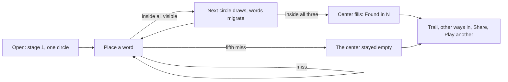

# Liminal design contract (proposed)

Status: superseded. This was the Narrowing proposal; the operator chose the
in-between direction instead, now built in `src/` and specified in the root
`DESIGN.md`. Kept as lineage.

## Overview

A daily puzzle for anyone with two minutes: name one thing that sits where
three ideas overlap. The board is a three-circle diagram whose circles arrive
one at a time; every guess is placed where it belongs. Many answers are right.

Scope: the play surface, end states, how-to, guess detail and report path.
Not designed: a brand mark, dark mode, an archive screen beyond "Play another".

## Game rules (proposed)

- Three conditions per puzzle, ordered. Stage n shows circles 1 to n.
- A guess is judged on all three conditions at once (unchanged judge and API).
  The board only shows verdicts for visible circles.
- A guess inside every visible circle opens the next circle. Words already on
  the board migrate to their new positions; a word inside the new circle too
  keeps opening circles (cascade).
- Solved when a word is inside all three. Score: guesses used, out of five.
- Refusals spend nothing: echo of a circle label, repeat of a placed word,
  empty, too long, judge uncertain, judge unreachable, rate limited.
- Inside, close and outside stay the three states. Close is drawn as "on the
  line".

## Journey



One page. No tabs. Today is the product; after finishing, "Play another" opens
unplayed and past puzzles (the current Practice mode moves here). Progress is
saved per puzzle as today.

## Colors

| Token | Hex | Role | Contrast on paper |
| --- | --- | --- | --- |
| paper | #fafaf8 | Page | |
| ink | #1e2126 | Text, primary button, solved center | 15.5:1 |
| quiet | #5c6169 | Secondary text, date, status | 6.0:1 |
| line | #d8dadd | Ghost rings, dividers, help button ring | decorative |
| target | ink at 6% | Region every visible circle shares | decorative |
| c1 / c1-text | #2a8fa3 / #1a6c7c | First circle ring / label | 3.6 / 5.8:1 |
| c2 / c2-text | #d0487f / #a53461 | Second circle | 4.1 / 6.2:1 |
| c3 / c3-text | #b98310 / #85590a | Third circle | 3.2 / 5.9:1 |
| field-border | #8a8f96 | Input and textarea border | 3.1:1 |
| placeholder | #6b7078 | Placeholder text | 4.8:1 |

Color is never the only signal: position shows the state, italic marks the
line, and every word has a text verdict in its detail and accessible name.

Position is not exact for every verdict. No point lies on all three lines at
once, so "on the line of every circle" cannot be placed, and crowding can push
a word off its region. Placement reports whether a word's center sits in its
true region; when it does not, the word carries explicit marks (one per
visible circle: filled inside, half on the line, ring outside). The word
detail is always the authoritative verdict.

## Typography

- **Newsreader** (Production Type, SIL OFL, Google Fonts): the player's words
  on the board, the field text, the wordmark, end title, other answers.
  Weights 500 and 600; italic for on-the-line words.
- **Schibsted Grotesk** (Schibsted, SIL OFL, Google Fonts): circle labels,
  status, buttons, help, detail. Weights 400 and 600.
- Load both through `next/font/google` (self-hosted at build, no runtime
  request). Fallbacks: Iowan Old Style, Georgia, serif; system-ui, sans-serif.
  Placement measures words after `document.fonts.ready`.

| Use | Size / line height | Weight |
| --- | --- | --- |
| Wordmark | 26 px | 600 serif |
| End title | 30 px | 600 serif |
| Board word | 17 px (16 px under 400 px) | 500 serif |
| Field | 19 px | 400 serif |
| Circle label | 14 px / 1.25 (13 px under 400 px) | 600 sans |
| Label clarifier | 13 px (12 px under 400 px) | 400 sans, quiet |
| Status, body | 15 to 16 px / 1.45 | 400 sans |

No all-caps labels, no numbered markers, no eyebrows.

## Layout

- Single column, max width 460 px, 16 px side padding. Header, board, status
  line, field, five dots. At 390 x 844 everything fits above the fold.
- Board: aspect 100:104. Circles radius 27 units, centers (36.5, 39.5),
  (63.5, 39.5), (50, 62.9); spacing equals radius. Labels: circle 1 top left,
  circle 2 top right, circle 3 centered below.
- Minimum supported width 320 px; verified at 360 px.

## Shape and elevation

Flat. Radius 12 px on field and buttons, 16 px on the how-to, pills on board
words. One shadow, on the guess detail only (0 10 30 ink at 14%).

## Components and states

| Component | States |
| --- | --- |
| Board | stage 1, 2, 3; ghost rings for unopened circles; target region per stage; solved (center ink, winner as paper-on-ink pill, other words in quiet ink at full opacity) |
| Board word | entering (fades in from bottom center), inside, on the line (italic), outside, inexact (marks under the word), hover (dotted underline), focus-visible (2 px ink ring), won |
| Field | idle ("Name a thing"), typing, placing (disabled, button "Placing"), refused (text kept and selected), hidden when finished |
| Status line | empty, placing (breathing), verdict, advance, refusal; hidden when finished |
| Dots | five; used filled ink; hidden when finished |
| End panel | solved ("Found in N"), unsolved ("The center stayed empty"); trail; other ways in; Share / Copied; Play another; next puzzle countdown on Today |
| How to play | opens on first visit and from "?" |
| Guess detail | verdict per visible circle; Disagree reveals a note field and Send; sent confirmation |

## Motion

| Moment | Trigger | Duration and easing | Purpose |
| --- | --- | --- | --- |
| Word lands | Judged guess | 650 ms, cubic-bezier(0.2, 0.7, 0.2, 1) | Shows where it belongs |
| Circle draws | Next circle opens | 700 ms stroke draw; label fades 400 ms after 250 ms | Announces the new condition |
| Words migrate | After a circle draws | 650 ms after 450 ms delay | The turn: words slide into or out of the new circle |
| Cascade | Word opens several circles | One step per circle, 1.1 s apart | Each circle gets its moment |
| Center fills | Solved | 700 ms fill after the last step | The one bold moment |
| End panel | Finished | 600 ms fade after the sequence | Result after the board finishes |

Reduced motion: every animation and delay collapses to the final state at
once. Re-layout happens on width change only, so mobile toolbars never cut a
sequence.

## Copy

Voice: plain, short, second person only where needed. One verb for the core
action: **Place**.

| Moment | String |
| --- | --- |
| Field placeholder | Name a thing |
| Button / pending | Place / Placing |
| Pending status | Placing “{word}” |
| Miss, one circle | “{word}” is outside. / “{word}” is on the line. |
| Miss, several | “{word}” is inside {n} of {m}, on the line of {k}. |
| Advance | “{word}” is in. A new circle. |
| Cascade | “{word}” fits the next circle too. One more. |
| Echo | That repeats a circle. Name a thing instead. |
| Repeat | “{word}” is already on the board. |
| Too long | Keep it to a short name. |
| Uncertain | Couldn’t place “{word}” with confidence. Try a more specific name. No guess used. |
| Unreachable | Couldn’t reach the judge. Try again in a moment. No guess used. |
| Rate limited | Too many tries at once. Wait a moment. No guess used. |
| Solved | Found in {n} |
| Unsolved | The center stayed empty |
| Answers | Other ways in: … / Ways in: … |
| Share | Share / Copied |
| Next | Next puzzle in {h}h {m}m |
| Detail states | Inside / On the line / Outside |
| Report | Disagree? / What did the board get wrong? / Send / Noted. Thanks. |
| How to play | Name a thing that fits inside every circle. Circles arrive one at a time. Land inside all of them to bring the next. A word on a line is almost in. Five guesses. Many right answers. |

Share text:

```
Liminal, September 23
●○·
●●◐
●●●
3 of 5
```

One row per guess, one mark per circle visible after that guess: ● inside,
◐ on the line, ○ outside, · not yet open. Unsolved ends with "X of 5".

## Accessibility

- Contrast targets above; non-text at 3:1 or more.
- Focus order: help, board words in guess order, field, button, end actions.
- Board words are buttons named "{word}. {label}: {state}; …".
- The status line and the end panel are polite live regions.
- Hit targets: field and buttons 52 px tall; board words at least 24 px tall.
- How to play is a native modal `dialog`; the guess detail closes on Escape.

## Authoring contract

- Each condition gets a player-facing `label` (short, no judge hedges) and an
  optional `detail` when a sense needs pinning ("as in succeed at it"). The
  judge keeps its own wording.
- Order the conditions so the turn is last.
- **Lure density:** at least two near misses must fail only the last
  condition. Current deck: bath-vessel 2, made-and-taken 4, kitchen-well 1
  (needs one more, such as a strainer), pass-or-fail 0. Pass or Fail becomes
  valid by reordering to fail, happens, pass: launch, takeover and rescue
  become lures. Bump `judgments.version` for any change, per `AGENTS.md`.
- Enforce lure density in `deck.test.ts`.

## Implementation mapping

| Piece | Where | New or changed |
| --- | --- | --- |
| Stage logic and share rows | `src/lib/liminal/stage.ts` (pure, from `engine.js` `stageTrail`, `shareText`) | New, unit tested |
| Board geometry and placement | `src/lib/liminal/placement.ts` (pure, from `board.js` `place`) | New, unit tested: each placed center lies in its region |
| Condition `label` and `detail` | `src/lib/liminal/types.ts`, `deck.ts` | Changed |
| Echo check against labels | `src/lib/liminal/evaluator.ts` | Changed |
| Play surface | `src/app/page.tsx`: Board, Field, Dots, EndPanel, HowTo, WordDetail | Rewrite; drop tabs, cabinet, chips, legend, title, teaser |
| Report | Inline in WordDetail, existing `/api/report` | Moved |
| Styles | `src/app/globals.css` | Replace |
| Fonts | `src/app/layout.tsx` via `next/font/google` | Changed |
| Brand mark | `public/brand/`, `src/app/icon.svg` | Open item: keyhole retires |
| Events | `guess_judged` could carry the stage | Optional; taxonomy change |
| Journeys | `e2e/qa-journeys.ts` | Update to the states below |

No new runtime dependencies.

## Validation plan

Capture and look at, at 390 px and 1280 px, plus 360 px for the longest
labels: how-to, idle stage 1, placing, advance, cascade, stage 3 with a lure
on the line, echo, repeat, uncertain, unreachable, rate limited, word detail,
report sent, solved after a turn, first guess solve, unsolved, reduced motion,
keyboard focus on a board word. Unit tests: stage progression and cascade,
share rows, lure density, and placement: for each of the 27 verdicts, the
placed center lies in its true region or the word is flagged inexact (triple
on the line is always inexact). Run axe-core on every captured state.

## Do and don't

- Do let position carry the feedback, with explicit marks wherever position
  cannot. Don't add a legend.
- Do keep one bold moment, the center filling. Don't animate anything else
  that the player did not cause.
- Don't bring back chips, tabs, titles, teasers, or numbered markers.
- Don't show a score beyond guesses used, and never a confidence value.
